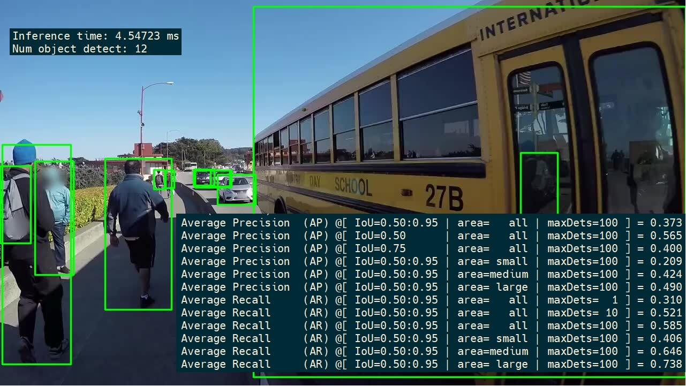
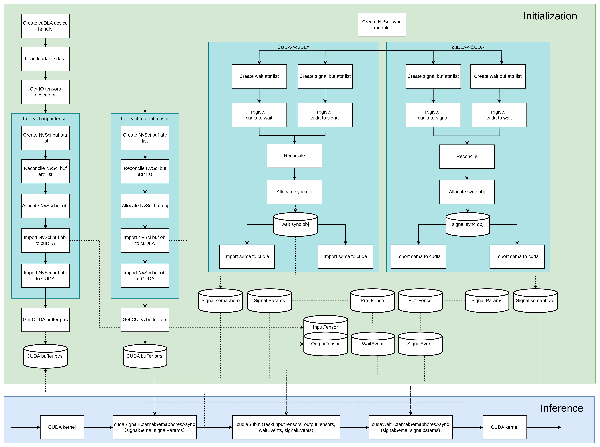

# YOLOv5 cuDLA sample

This sample demonstrates QAT training&deploying YOLOv5s on Orin DLA, which includes:
1. YOLOv5s QAT training. - see [export](./export)
2. Deploy YOLOv5s QAT model with TensorRT and cuDLA.
    - Convert QAT model to PTQ model and INT8 calibration cache. - see [export](./export)
    - Build DLA standalone loadable with TensorRT(INT8/FP16). - see [data/model](./data/model)
    - Load and run the DLA loadable with cuDLA. - see [src](./src)
3. Validate DLA performance and accuracy on COCO 2017 val dataset. - see [test_coco_map](./test_coco_map.py)


# Prerequisite

```
sudo apt update
sudo apt install libopencv-dev libjsoncpp-dev python3-pip git git-lfs

# If want to mAP benchmark with COCO dataset, download COCO tool and dataset 
pip3 install pycocotools
cd data/
bash download_coco_validation_set.sh

# cmake >= 3.18
# if pre-installed cmake is lower than 3.18, src/matx_reformat/build_matx_reformat.sh
# will install it for you

```

# YOLOv5 QAT Training and ONNX Export

Refer to [export/README.md](./export/README.md).

# Build and Run

```
git clone --recursive https://github.com/NVIDIA-AI-IOT/cuDLA-samples.git
```

If your OS version is less than Drive OS 6.0.8.0 or Jetpack 6.0, please apply trtexec-dla-standalone-trtv8.5.patch(for trt 8.5, for other version you may need to apply it manually) to trtexec and re-built.

```
cp data/trtexec-dla-standalone-trtv8.5.patch /usr/src/tensorrt/
cd /usr/src/tensorrt/
git apply trtexec-dla-standalone-trtv8.5.patch
cd samples/trtexec
sudo make
```

Build loadable and compile matx reformat lib
```
# Build INT8 and FP16 loadable from ONNX in this project
bash data/model/build_dla_standalone_loadable.sh
# Build matx used in pre-/post-processing
bash src/matx_reformat/build_matx_reformat.sh
```

Run the sample with DLA hybrid mode
```
make clean
# Run INT8 inference on single image
make run
# Or run COCO validation
make validate_cudla_int8 # or make validate_cudla_fp16
```

Run the sample with DLA standalone mode
```
# "make clean" is needed when switch between hybrid mode and standalone mode
make clean
# Run INT8 inference on single image
make run USE_DLA_STANDALONE_MODE=1
# Or run COCO validation
make validate_cudla_int8 USE_DLA_STANDALONE_MODE=1
# or make validate_cudla_fp16 USE_DLA_STANDALONE_MODE=1
```

# mAP over COCO 2017

|YOLOv5s |Official Data|DLA FP16|DLA INT8 QAT|GPU INT8 QAT|
|:----|:----|:----|:----|:----|
|mAP|[37.4](https://github.com/ultralytics/yolov5#pretrained-checkpoints)|37.5|37.1|36.8|

Note: 
1. We use inference resolution of 1x3x672x672 to get this mAP.
2. Fallback the last 4 layers to FP16 in the last head can increase mAP from 37.1 to 37.3, but the perf will drop little from 4.0ms to 4.46ms. This can be tested with a new loadble built by `bash data/model/build_dla_standalone_loadable_v2.sh `

# Performance

| Platform | GPU clock | Memory clock | DLA clock | TensorRT Version | DLA Version |
| --- | --- | --- | --- | --- | --- |
| Orin-X | 1275 MHz | 3200 MHz | 1331 MHz | 8.6 | 3.14 |

| Batch Size | DLA INT8(int8:hwc4 in + fp16:chw16 out) (ms) | GPU INT8(int8:chw32 in + fp16:chw16 out) (ms) |
| ---------- | --------------------------------------- | ---------------------------------------- |
| 1          | 3.82                              | 1.82                               |
| 2          | 7.68                             | 2.91                               |
| 4          | 15.17                             | 4.99                               |
| 8          | 30.92                              | 9.19                               |
| 12         | 46.71                             | 13.27                               |
| 16         | 62.54                             | 16.87                              |

- If we use `int8:hwc4 in + int8:chw32 out` then we can get perf of about 2.4ms(bs=1) for DLA INT8, but it will lead to small accuracy drop. We will optimize this in the future.
- The inference time(median GPU computing time) here is taken with trtexec which use some pre-launch technique to maximize the through put, so it's slightly better than the inference time measure in the pipeline.

# DLA Hybrid Mode and DLA Standalone Mode

This sample demonstrates how to use DLA hybrid mode and DLA standalone mode for a CUDA->cuDLA->CUDA pipeline. More details on DLA hybrid mode and DLA standalone mode can be found at https://docs.nvidia.com/cuda/cuda-for-tegra-appnote/index.html#memory-model.

Using DLA hybrid mode allows quick integration with other CUDA tasks, all we need to do is register CUDA memory to cuDLA.


Use DLA standalone mode can prevent the CUDA context creation, and thus improve the parallelism with other GPU task. cuDLA's standalone mode make use of NvSci to finish the data transfer and synchronization with other modules like camera, GPU or CPU.



Our DLA hybrid mode context code and standalone mode context code has no other dependencies from the sample, thus it can be integrated to user's application quickly. Just copy the src/cuda_context_hybird.* or src/cuda_context_standalone.* to your own project, add necessary include path and link libraries(Check ./Makefile). then you can make use of our code directly.
# Notes

- The scale used for FP32 to INT8 conversion in pre-processing is hardcoded, which value is from the first layer of the calibration cache, check [mInputScale](./src/yolov5.h) and [images: 3c00f9f4](./data/model/qat2ptq.cache). For more information about QAT, check [pytorch-quantization](https://github.com/NVIDIA/TensorRT/tree/main/tools/pytorch-quantization). For more information about quantization inside TensorRT, check [TensorRT Developer Guide](https://docs.nvidia.com/deeplearning/tensorrt/developer-guide/index.html#working-with-int8)
- Need to use below Input and Output format for cuDLA INT8 and FP16. More info about DLA I/O format can be found in **[I/O Formats on DLA](https://docs.nvidia.com/deeplearning/tensorrt/developer-guide/index.html#restrictions-with-dla)**. 
The INT8 cuDLA inference in this sample uses _INT8 Input:kDLA_LINEAR,kDLA_HWC4 + FP16 Output:kDLA_LINEAR,kCHW16_. 

| I/O          |  Format            |
| -------------| -------------------|
| INT8 Input   | kDLA_LINEAR,kDLA_HWC4,kCHW32 |
| FP16 Input   | kDLA_LINEAR,kCHW16 |
| INT8 Output  | kDLA_LINEAR,kCHW32 |
| FP16 Output  | kDLA_LINEAR,kCHW16 |

- NVIDIA reserves the right to change road map without implicit assumption of API and compatibility support.

# Reference Link
https://github.com/NVIDIA/Deep-Learning-Accelerator-SW  
https://developer.nvidia.com/blog/maximizing-deep-learning-performance-on-nvidia-jetson-orin-with-dla 
